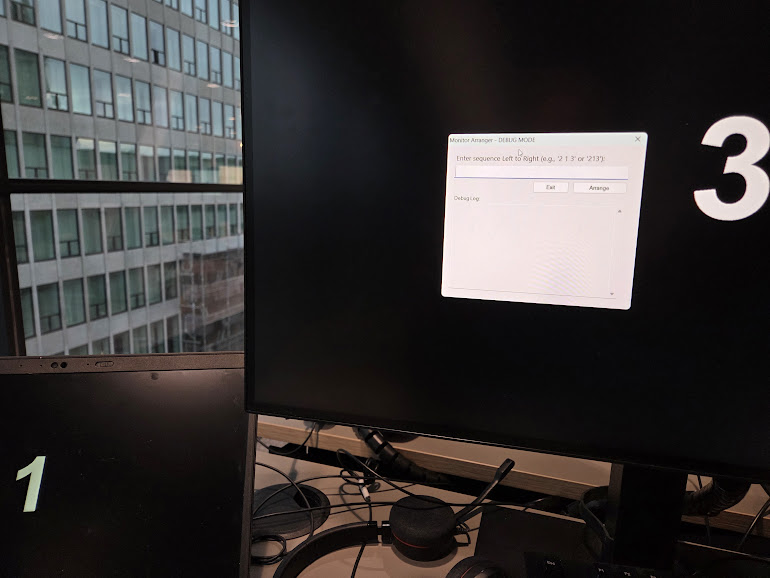

# Monitor Arranger

A lightweight, single-file C# utility designed for hot-desking environments. It simplifies the process of rearranging multiple monitors when connecting a laptop to a docking station, eliminating the need to drag and drop screens in Windows Settings.

## The Problem

When connecting a laptop to a new dock or hub, Windows often defaults to a random left-to-right order or defaults to "Duplicate" mode. Users typically have to:

1.  Open Windows Settings.
2.  Identify screens.
3.  Manually drag and drop them into the correct physical order.

## The Solution

Monitor Arranger automates this:

-   It forces Windows into "Extend" mode immediately.
-   It flashes a large, high-contrast identification number on every screen.
-   You simply type the physical order you see (e.g., `2 1 3`) into a popup window.
-   The app rearranges the screens logically from left to right, aligning their tops.

## Features


-   **Zero-Config**: Just run the executable. No installation required.
-   **Auto-Extend**: Automatically switches display topology from "Duplicate" or "Internal Only" to "Extend" upon launch.
-   **Stabilization Loop**: Includes a smart wait timer that detects when monitors are finished resizing/initializing after docking to prevent graphical glitches.
-   **DPI Aware**: Correctly handles mixed-DPI environments (e.g., a 150% scaled laptop next to 100% scaled monitors) to prevent gaps or overlapping coordinate errors.
-   **Flexible Input**: Accepts input with spaces (`3 2 1`) or condensed (`321`).
-   **Debug Mode**: Built-in log window shows detected resolutions and Windows API error codes for troubleshooting.
-   **Safety**: Press `ESC` at any time to close the application.

## Prerequisites

-   **OS**: Windows 10 or Windows 11.
-   **Runtime**: .NET 6.0 or higher (or .NET Framework 4.7.2+ if compiled against it).

## How to Build

You can build this using the .NET SDK command line.

1.  Save the code as `MonitorArranger.cs`.
2.  Run the following command (copy-paste the whole line):
```powershell
C:\Users\bko\OneDrive - Netcompany\Desktop\screenRearrange>C:\Windows\Microsoft.NET\Framework64\v4.0.30319\csc.exe /target:winexe /out:MonitorArranger.exe /reference:System.Windows.Forms.dll /reference:System.Drawing.dll screenArranagement.cs
```

## Usage

1.  Connect your laptop to the dock.
2.  Run `MonitorArranger.exe`.
3.  Wait a few seconds for the screens to flicker and numbers to appear.
4.  A control window will appear (offset from the center so it doesn't block the number).
5.  Type the numbers as they appear from Left to Right.
    -   *Example*: If the left screen is `3`, middle is `1`, and right is `2`, type `312`.
6.  Press `Enter` or click **Arrange**.

## Troubleshooting

-   **Screens didn't move**: Check the "Debug Log" in the application window. If you see `DISP_CHANGE_BADMODE` or `DISP_CHANGE_BADPARAM`, it usually means the monitor resolutions were detected incorrectly. Try running the app again once the screens have settled.
-   **Teal/Black bars on screen**: The app likely grabbed the screen bounds before Windows finished extending the desktop. Restart the app.
